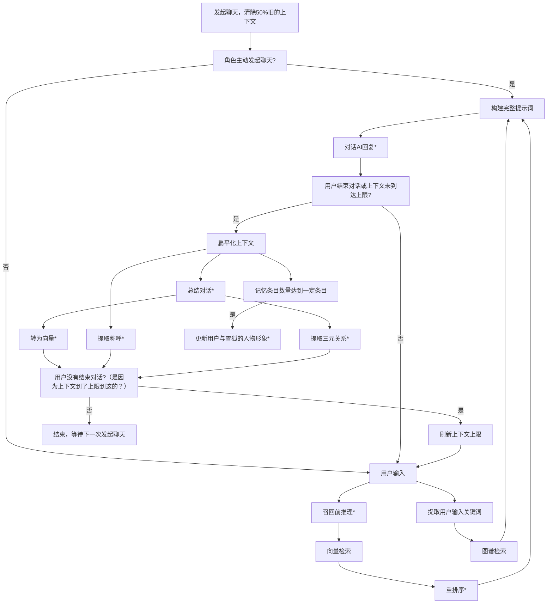

# 关于游戏AI记忆系统的说明

各位玩家好，

我是本作的独立开发者。首先，衷心感谢大家的热心反馈，特别是关于AI角色记忆力的讨论。这证明大家真正投入到了与角色的互动中，这对我而言是最大的鼓励。

为了让大家更理解当前系统的设计，并明确未来的发展方向，我想在此对AI记忆系统进行一次集中的说明。

## 1. 当前记忆系统是如何工作的？

目前游戏的记忆系统是一个在资源和技术限制下权衡的产物，它分为多个层级，协同工作：

*   **短期记忆（对话上下文）**：最多保留**最近16条**对话，作为AI的上下文。每次开始对话时，如果距离上次对话小于5分钟，会继承上次50%的上下文以保持连贯；否则会清除上下文以降低关联性。
*   **中期记忆（会话总结）**：在**每次聊天结束后**，AI会自动生成一份关于本次对话的摘要，作为一个“记忆条目”被保存下来。新一轮对话最多会携带**12条**最近的记忆条目，作为聊天的背景知识。
*   **长期记忆（检索增强生成）**：所有的“记忆条目”都会存入一个本地的向量数据库中。每次对话前，会根据你说的话，从数据库中检索出**5条**最相关的记忆。同时，系统还会提取对话中的关键信息构建**记忆图谱**，包括角色关系、重要事件等。记忆图谱带有遗忘机制，不重要的记忆将很快被遗忘。
*   **角色印象与称呼**：这是一个动态系统。AI会基于多次的互动，总结并更新对玩家的“印象”。同时，它也会记住并使用你对它认可的“称呼”。

> ↑ 对话的工作流程，*表示需要调用API

**设计理念**：这个系统模拟了人类的记忆模式——清晰地记得刚才的事，概括地记得最近的事，并需要“提示”来回忆起很久以前相关的事。

### 各阶段对比（仅为大致的参考）
| 阶段 | token成本 | 延迟 | 性能提升 |
|-------|-------|-------|-------|
| **保存记忆向量** | 低 | \\ | \\ |
| └ 启用语义检索 | 高 | 低 | 高 |
| &emsp;├ 召回前推理 | 高 | 高 | 中 |
| &emsp;└ 启用重排序 | 低 | 低 | 中 |
| **保存知识图谱** | 中 | \\ | \\ |
| └启用知识图谱 | 中 | 低 | 中 |

我承认现在的记忆系统还不够好，但即便我有能力把它做得更好，目前也因为各种限制而没能实现...

## 2. 关于我的精力与能力：一份坦诚的澄清

我需要坦诚地告诉大家，我是一名**高中生**，同时也是这款游戏的**独立开发者**。这意味着：

*   **精力有限**：我需要平衡学业、生活与开发工作，无法像全职团队那样投入所有时间。
*   **能力边界**：我所掌握的技术和能调动的资源，与大型科技公司相比有天壤之别。当前这套记忆系统，已经是我在现有知识、时间和预算下所能实现的最佳方案。

我完全理解大家对“完美记忆数字生命”的期待，这同样也是我的梦想。但以现阶段的技术普及程度和我个人能力而言，实现它的难度极大。

## 3. 游戏的核心方向：是“游戏”，而非“AI实验室”

这一点至关重要。本作的开发初衷，是创造一款**好玩的、有情感交互的游戏体验**，而不是一个展示前沿AI技术的测试平台。

我的开发重心会更多地倾向于**游戏**而非**AI对话**

如果将所有精力都投入到无止境的“记忆精度”竞赛中，会本末倒置，让游戏本身失去活力。

## 4. 关于“更优”解决方案的探讨与取舍

有些玩家可能会问，为什么不用微调模型等更高级的技术来彻底解决记忆问题？

事实上，这些方案我都考虑过，但之所以不采用，原因如下：

*   **微调模型**：
    *   **成本与硬件**：微调模型需要强大的算力。这对于一个没有服务器的单机游戏来说是不可行的；服务平台的微调模型价格很也高
    *   **数据与泛化性**：需要海量的、高质量的对话数据，且微调后的模型可能会丧失原有的灵活性和泛化能力。
*   **无限扩展上下文**：
    *   **成本与延迟**：即使使用支持长上下文的模型，无限制地携带所有历史记录，将导致**API调用成本急剧上升**和**响应速度显著变慢**，严重影响所有玩家的游戏体验。

因此，当前的方案是在 **“效果、成本、响应速度、开发难度”** 之间取得的一个现实平衡。

## 5. 最后，我想说……

你的每一份反馈都是我前进的动力。虽然我无法承诺打造一个拥有“完美记忆”的数字生命，但我可以承诺，我会在力所能及的范围内，持续优化这个系统，让大家与角色的互动变得越来越生动。

感谢你的理解与支持！让我们共同见证这个小小世界的成长。